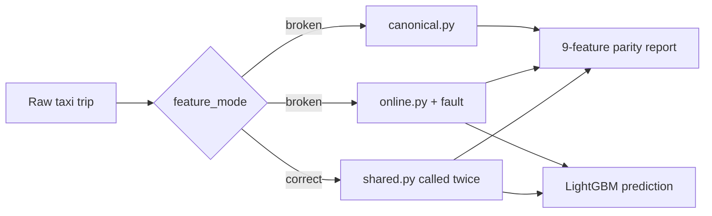

# Skewless — Training-Serving Feature Parity

> An interactive FastAPI and React demo showing how duplicated feature engineering creates training-serving skew—and how one shared transformation eliminates it.

## Why this project exists

A model can perform well during training and still return wrong production predictions without its weights changing. The failure can happen earlier in the pipeline: training and serving may calculate the same named feature differently.

A distance trained in miles but served in kilometres is still a valid number. The API does not crash and the model still responds, but it scores the wrong feature vector. This is **training-serving feature skew**.

Skewless makes that normally silent failure visible by building a training reference vector and a serving vector for the same raw NYC taxi trip, comparing all nine features, and scoring the serving vector.

## Broken versus Correct

| Mode | Training features | Serving features | Result |
|---|---|---|---|
| `broken` | `canonical.py` | independent `online.py` plus an optional fault | Duplicated logic can diverge |
| `correct` | `shared.py` | the same `shared.py` | 9/9 parity by construction |

In **Broken** mode, `online.py` intentionally owns an independent implementation and never calls `canonical.py` or `shared.py`. This reproduces the maintenance risk found in separate training and production pipelines.

In **Correct** mode, both paths call one transformation from `shared.py`. Fault injection is not applied because there is no separate serving transformation to corrupt.



## Supported skew scenarios

Only three modes exist:

| `skew_mode` | Serving behavior in Broken mode |
|---|---|
| `none` | No injected fault |
| `distance_unit` | Multiplies miles by `1.609344`, simulating kilometres in a miles feature |
| `timezone` | Derives calendar features in UTC instead of `America/New_York` |

The model schema remains fixed at nine features:

```text
trip_distance_miles   passenger_count       pickup_location_id
dropoff_location_id  pickup_hour           pickup_day_of_week
pickup_month         is_weekend            is_rush_hour
```

The canonical and shared transformations use identical timezone conversion, six-decimal distance rounding, missing-passenger default of one, weekday/month extraction, weekend logic, and 07:00–10:00 / 16:00–19:00 rush-hour windows.

## Quick start

Requirements: Python 3.11+ and Node.js 22+.

### 1. Run the API

From the repository root:

```bash
python3 -m venv .venv
source .venv/bin/activate
python -m pip install -r requirements.txt
PYTHONPATH=src uvicorn api.main:app --reload
```

The included `models/fare_model.joblib` is ready to use. FastAPI runs at [http://localhost:8000](http://localhost:8000), and its interactive OpenAPI documentation is at [http://localhost:8000/docs](http://localhost:8000/docs).

### 2. Run the frontend

In a second terminal:

```bash
cd frontend
npm ci
npm run dev
```

Open [http://localhost:5173](http://localhost:5173). The Vite development server talks to the API on port `8000`; set `VITE_API_BASE_URL` if the API is hosted elsewhere.

## Demo walkthrough

The UI opens with a deterministic UTC trip and `distance_unit` selected.

1. Leave the architecture on **Broken** and click **Run parity check**.
2. Observe `8 / 9` matched features. `trip_distance_miles` changes from `4.5` to `7.242048`, and the serving vector produces a different fare.
3. Keep the same trip and skew scenario, then switch only the architecture to **Correct**.
4. Run the check again. Both paths use `shared.py`, the fault is not applied, and the report shows `9 / 9` matched features.

With the bundled model, the current default demo produces approximately `$29.19` in Broken mode and `$20.29` in Correct mode. Small changes are expected if the model is retrained.

Direct API example:

```bash
curl -X POST http://localhost:8000/predict \
  -H 'Content-Type: application/json' \
  -d '{
    "pickup_datetime": "2024-01-08T13:30:00Z",
    "pickup_location_id": 132,
    "dropoff_location_id": 236,
    "passenger_count": 2,
    "trip_distance_miles": 4.5,
    "feature_mode": "broken",
    "skew_mode": "distance_unit"
  }'
```

The response includes the scored fare, full training and serving vectors, all nine comparisons, requested versus applied skew mode, and a concise mismatch list.

## Tech stack

- **Model:** LightGBM, scikit-learn, pandas, NumPy
- **Artifacts:** joblib and JSON metadata
- **API:** FastAPI, Pydantic, Uvicorn
- **Frontend:** React, TypeScript, Tailwind CSS, Vite
- **Quality:** pytest, Ruff, mypy, oxlint, GitHub Actions

## Train the model

The trained model is committed so the demo works immediately. To reproduce it, download the January 2024 NYC Yellow Taxi Trip Records Parquet file and place it at:

```text
data/raw/yellow_tripdata_2024-01.parquet
```

The raw dataset is intentionally ignored by Git. Then run:

```bash
PYTHONPATH=src python -m model.train --row-limit 100000
```

Training validates the rows, builds features through `shared.py`, evaluates the regressor, and writes:

```text
models/fare_model.joblib
models/metadata.json
```

## Project structure

```text
skewless/
├── src/
│   ├── features/
│   │   ├── canonical.py
│   │   ├── online.py
│   │   ├── shared.py
│   │   ├── parity.py
│   │   └── faults.py
│   ├── model/
│   │   ├── train.py
│   │   └── predictor.py
│   └── api/
│       └── main.py
├── frontend/
├── data/
├── models/
├── tests/
├── requirements.txt
└── README.md
```

## Screenshots

Add final portfolio screenshots after starting both applications:

- `docs/screenshots/broken-distance-skew.png` — Broken mode showing the distance mismatch and changed fare
- `docs/screenshots/correct-perfect-parity.png` — Correct mode showing 9/9 parity on the same trip

These paths are placeholders; screenshots are not yet committed.

## Verification

```bash
python -m pytest
python -m ruff format --check src tests
python -m ruff check src tests
python -m mypy src

cd frontend
npm run build
npm run lint
```

GitHub Actions runs the same backend and frontend checks on pushes and pull requests.
