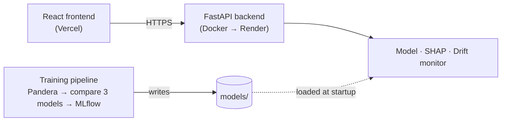
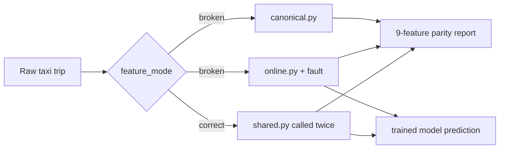

# Skewless — Training-Serving Feature Parity

## Overview

Skewless is a production-shaped ML system built to demonstrate one concrete failure mode:
**training-serving feature skew**. This occurs when the logic used to build features during
training differs from the logic used for live predictions. Both pipelines may produce a
feature with the same name and a valid numeric value, while the model receives a meaningfully
different input in production.

The project makes that normally silent mismatch observable. For the same raw NYC taxi trip,
Skewless builds a training reference vector and a serving vector, compares all nine features,
and shows how duplicated transformation logic can produce a different prediction without an
exception or failed API request. It then demonstrates the corrective design: one shared
feature transformation used by both paths.

Around that example, the repository shows the surrounding ML lifecycle: Pandera validation,
three-model comparison, MLflow experiment tracking, persisted model artifacts, FastAPI
serving, SHAP explanations, PSI-based drift monitoring, containerized local execution, and a
live deployment.

## Live Demo

- **Frontend:** https://skewless.vercel.app
- **API:** https://skewless-api.onrender.com ([interactive Swagger docs](https://skewless-api.onrender.com/docs))

The backend runs on Render's free tier and spins down after 15 minutes idle — the first
request after a quiet period can take up to a minute to wake it back up.

## Why This Project Matters

Many ML failures do not look like software failures. The service stays healthy, the request
schema passes validation, and the model returns a prediction—but the value being scored no
longer represents the feature used during training.

- Training and production pipelines can evolve independently when transformation logic is
  duplicated.
- Matching feature names do not guarantee matching feature values or semantics.
- Valid-looking values, such as kilometres supplied to a feature trained in miles, can pass
  through an API without triggering an error.
- Skewless makes this failure visible by comparing training and serving vectors feature by
  feature, then contrasts the broken design with a shared-transformation design.

The result is a focused example of why feature parity is an engineering requirement, not only
a model-quality concern.

## How the Demonstration Works

A distance trained in miles but served in kilometres is still a valid number. The API
doesn't crash and the model still responds — it just scores the wrong feature vector. Skewless
builds a training reference vector and a serving vector for the same raw NYC taxi trip,
compares all nine features, and scores the serving vector, so this normally-silent failure
becomes a visible `8 / 9 matched` in the response.

## Key Features

- **Feature-parity diagnostics** — Compares all nine training and serving features for the
  same raw request, making a mismatch identifiable before it is reduced to a prediction.
- **Broken-versus-correct pipeline comparison** — Provides a controlled way to observe the
  maintenance risk of duplicated transformations and the parity guarantee of a shared
  transformation.
- **Model comparison and selection** — Evaluates Ridge, Random Forest, and LightGBM on the
  same split using MAE, RMSE, and R², then selects the lowest-RMSE candidate.
- **Training-data validation** — Uses a declarative Pandera schema before training, replacing
  hand-written row-filtering logic with an explicit data contract.
- **Experiment traceability** — Logs each candidate's parameters and metrics as a separate
  MLflow run, marks the selected run, and attaches the winning model artifact.
- **Model explainability** — Provides per-prediction SHAP contributions and dataset-level
  feature importance so engineers can inspect model behavior at local and global levels.
- **Drift visibility** — Compares served traffic with the training reference distribution
  using an in-memory Population Stability Index monitor, without adding a database.
- **Reproducible execution and deployment** — Containerizes the backend and frontend for
  local use with Docker Compose, with the live FastAPI and React applications deployed on
  Render and Vercel and verified end to end including CORS.

## Production ML Workflow

```text
Data Validation (Pandera)
        ↓
Feature Engineering (shared transformation)
        ↓
Model Training (Ridge · Random Forest · LightGBM)
        ↓
Experiment Tracking (MLflow)
        ↓
Model Artifact (model + metadata + reference statistics)
        ↓
API Serving (FastAPI)
        ↓
Explainability (SHAP)
        ↓
Drift Monitoring (in-memory PSI)
```

Training produces the artifacts under `models/`; the API loads them at startup and does not
depend on the training data or MLflow while serving requests.

## Architecture



The frontend calls the backend directly over HTTPS; the backend loads whatever the offline
training pipeline last wrote to `models/` — it never touches the training data or MLflow.
Full breakdown of every subsystem (training pipeline, Pandera schema, MLflow workflow, SHAP
internals, drift math, Docker/Render/Vercel config) is in
[`docs/ARCHITECTURE.md`](docs/ARCHITECTURE.md), including a more detailed diagram.

## Key Engineering Decisions

- **Share the correct transformation path.** In Correct mode, training and serving both call
  `shared.py`, preventing two implementations of the same feature definition from drifting
  apart. Broken mode keeps separate implementations intentionally so the failure remains
  demonstrable.
- **Validate data before training.** Pandera defines the accepted raw-data schema and filters
  invalid rows before feature construction and model comparison.
- **Track candidates independently.** MLflow records every candidate as its own run with
  parameters, metrics, and selection status, preserving the evidence behind model selection.
- **Separate offline training from online serving.** The training pipeline writes the model,
  metadata, comparison results, and reference statistics to `models/`; the API loads those
  artifacts without accessing the training dataset or MLflow.
- **Explain predictions at two levels.** SHAP supports both per-request feature contributions
  and global mean absolute feature importance.
- **Keep drift monitoring lightweight.** The PSI monitor compares in-memory serving traffic
  with the persisted training reference distribution and intentionally uses no database.

## Broken versus Correct Feature Pipelines

| Mode | Training features | Serving features | Result |
|---|---|---|---|
| `broken` | `canonical.py` | independent `online.py` plus an optional fault | Duplicated logic can diverge |
| `correct` | `shared.py` | the same `shared.py` | 9/9 parity by construction |

In **Broken** mode, `online.py` intentionally owns an independent implementation and never
calls `canonical.py` or `shared.py`, reproducing the maintenance risk of separate training and
production pipelines. In **Correct** mode, both paths call one transformation from
`shared.py` — fault injection has nothing separate to corrupt.



### Supported Skew Scenarios

| `skew_mode` | Serving behavior in Broken mode |
|---|---|
| `none` | No injected fault |
| `distance_unit` | Multiplies miles by `1.609344`, simulating kilometres in a miles feature |
| `timezone` | Derives calendar features in UTC instead of `America/New_York` |

The model schema is fixed at nine features: `trip_distance_miles`, `passenger_count`,
`pickup_location_id`, `dropoff_location_id`, `pickup_hour`, `pickup_day_of_week`,
`pickup_month`, `is_weekend`, `is_rush_hour`. The canonical and shared transformations use
identical timezone conversion, six-decimal distance rounding, missing-passenger default of
one, weekday/month extraction, weekend logic, and 07:00–10:00 / 16:00–19:00 rush-hour windows.

## Model Comparison

Training compares three regressors on the same 80/20 split and selects the lowest-RMSE
candidate. Results from a full run (`--row-limit 100000`, 95,759 valid rows after Pandera
filtering):

| Model | MAE | RMSE | R² |
|---|---|---|---|
| Random Forest | 2.23 | **5.96** | 0.922 |
| LightGBM | 2.04 | 6.77 | 0.900 |
| Ridge | 2.95 | 7.06 | 0.891 |

The LightGBM row matches the currently deployed model's committed `models/metadata.json`
exactly — it was trained before this comparison step existed, with the same hyperparameters
and split. Retraining today would select Random Forest instead; the deployed model hasn't
been swapped, on purpose, so the demo's numbers stay stable while this README and
`docs/ARCHITECTURE.md` are written. Retraining regenerates `model_comparison.json` with
current numbers for whichever model wins.

## API Endpoints

| Method | Path | Purpose |
|---|---|---|
| `POST` | `/predict` | Score a trip; returns the fare, both feature vectors, and the parity report |
| `POST` | `/explain` | SHAP contributions for the serving vector of the same request |
| `GET` | `/explain/global-importance` | Dataset-level mean absolute SHAP importance |
| `GET` | `/monitoring/drift` | PSI-based drift report vs. the training reference distribution |
| `GET` | `/model-info` | Model name, feature names, training metadata |
| `GET` | `/health` | Liveness check (also Render's health-check path) |

Full request/response schemas: [skewless-api.onrender.com/docs](https://skewless-api.onrender.com/docs).

## Quick Start

Requirements: Python 3.11+ and Node.js 22+.

### 1. Run the API

```bash
python3 -m venv .venv
source .venv/bin/activate
python -m pip install -r requirements.txt
PYTHONPATH=src uvicorn api.main:app --reload
```

The included `models/fare_model.joblib` is ready to use. FastAPI runs at
[http://localhost:8000](http://localhost:8000); interactive docs at
[http://localhost:8000/docs](http://localhost:8000/docs).

### 2. Run the frontend

In a second terminal:

```bash
cd frontend
npm ci
npm run dev
```

Open [http://localhost:5173](http://localhost:5173). Set `VITE_API_BASE_URL` if the API is
hosted elsewhere.

### 3. Or run both with Docker

```bash
docker compose up --build
```

Starts both containers: the API at [http://localhost:8000](http://localhost:8000) and the
frontend at [http://localhost:8080](http://localhost:8080) (note: 8080, not the `npm run dev`
port 5173). The frontend's API URL is baked in at image build time via the
`VITE_API_BASE_URL` build arg; `docker-compose.yml` sets the backend's `CORS_ALLOWED_ORIGINS`
to match. Stop with `docker compose down`.

## Demo Walkthrough

The UI opens with a deterministic UTC trip and `distance_unit` selected.

1. Leave the architecture on **Broken** and click **Run parity check**. Observe `8 / 9`
   matched features — `trip_distance_miles` changes from `4.5` to `7.242048`, and the serving
   vector produces a different fare (**$29.19** with the bundled model).
2. Switch only the architecture to **Correct** and run again. Both paths use `shared.py`, the
   fault is not applied, and the report shows `9 / 9` matched (**$20.29**).

```bash
curl -X POST https://skewless-api.onrender.com/predict \
  -H 'Content-Type: application/json' \
  -d '{
    "pickup_datetime": "2024-01-08T13:30:00Z",
    "pickup_location_id": 132,
    "dropoff_location_id": 236,
    "passenger_count": 2,
    "trip_distance_miles": 4.5,
    "feature_mode": "broken",
    "skew_mode": "distance_unit"
  }'
```

## Screenshots

Both captures use the same default trip and `distance_unit` scenario. Only the feature
architecture changes.

### Broken — duplicated paths


### Correct — shared transformation


Capture details: [`docs/screenshots/README.md`](docs/screenshots/README.md).

## Train the Model

The trained model is committed so the demo works immediately. To reproduce it, download the
January 2024 NYC Yellow Taxi Trip Records parquet file to
`data/raw/yellow_tripdata_2024-01.parquet` (intentionally gitignored), then:

```bash
PYTHONPATH=src python -m model.train --row-limit 100000
```

This validates raw rows against a Pandera schema, drops any that fail, builds features
through `shared.py`, trains and compares the three candidates ([Model comparison](#model-comparison)
above), logs every run to MLflow, and writes:

```text
models/fare_model.joblib        # the selected model
models/metadata.json            # selected model's metadata and metrics
models/model_comparison.json    # MAE/RMSE/R² for all three candidates
models/reference_stats.json     # per-feature training distribution, for drift monitoring
```

## Tech Stack

- **Model:** LightGBM, Random Forest, Ridge (scikit-learn), pandas, NumPy
- **Experiment tracking:** MLflow
- **Data validation:** Pandera
- **Explainability:** SHAP
- **Drift monitoring:** in-memory PSI (`model/drift.py`)
- **API:** FastAPI, Pydantic, Uvicorn
- **Frontend:** React, TypeScript, Tailwind CSS, Vite
- **Infra:** Docker, Render (backend), Vercel (frontend)
- **Quality:** pytest, Ruff, mypy, oxlint, GitHub Actions

## Project Structure

```text
skewless/
├── src/
│   ├── features/       # canonical.py, online.py, shared.py, faults.py, parity.py
│   ├── model/          # train.py, schema.py, predictor.py, explain.py, drift.py
│   └── api/            # main.py — all six endpoints
├── frontend/
├── docs/
│   ├── ARCHITECTURE.md # full system design + diagram
│   └── screenshots/
├── models/              # committed model + JSON artifacts
├── tests/
├── Dockerfile            # backend image
├── docker-compose.yml
├── render.yaml           # Render Blueprint (backend deploy)
├── requirements.txt
└── README.md
```

## Verification

```bash
python -m pip install -e ".[dev]"

python -m pytest
python -m ruff format --check src tests
python -m ruff check src tests
python -m mypy src

cd frontend
npm run build
npm run lint
```

GitHub Actions runs the same backend and frontend checks on pushes and pull requests.

## Deploy Your Own Copy

The backend deploys as-is from the root `Dockerfile`; the frontend deploys as a static Vite
build (no Docker involved in the actual Vercel deployment). Deploy the backend first — the
frontend build needs its URL.

**1. Backend → Render.** `render.yaml` is a Render Blueprint that builds `Dockerfile`
unchanged: dashboard → New → Blueprint → point at this repo → Free plan. Leave
`CORS_ALLOWED_ORIGINS` unset for now (the blueprint marks it manual-entry); note the
service's `.onrender.com` URL once it's live.

**2. Frontend → Vercel.** Import the repo, then set **Root Directory** to `frontend` and add
environment variable `VITE_API_BASE_URL` = the Render URL from step 1. Vercel auto-detects
Vite; `VITE_API_BASE_URL` is inlined at build time, so redeploy after changing it.

**3. Close the loop.** Once Vercel gives you a URL, set
`CORS_ALLOWED_ORIGINS=https://<your-app>.vercel.app` on the Render service (Environment tab).
Render restarts automatically. Comma-separate multiple origins if needed.
