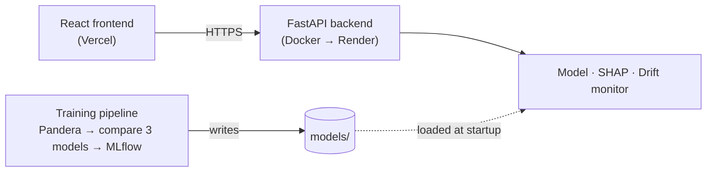
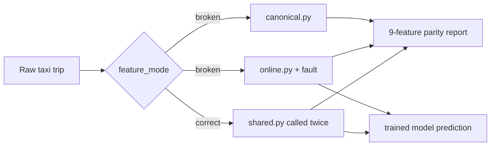
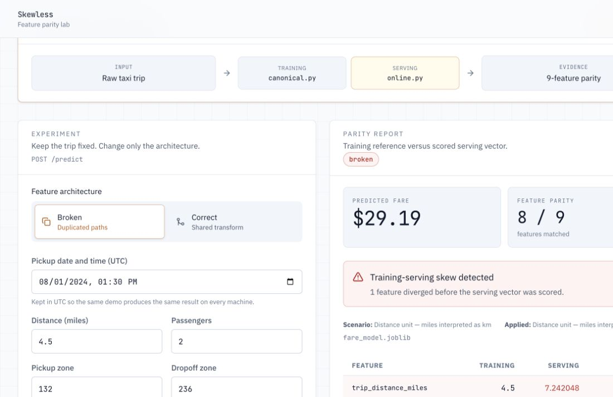
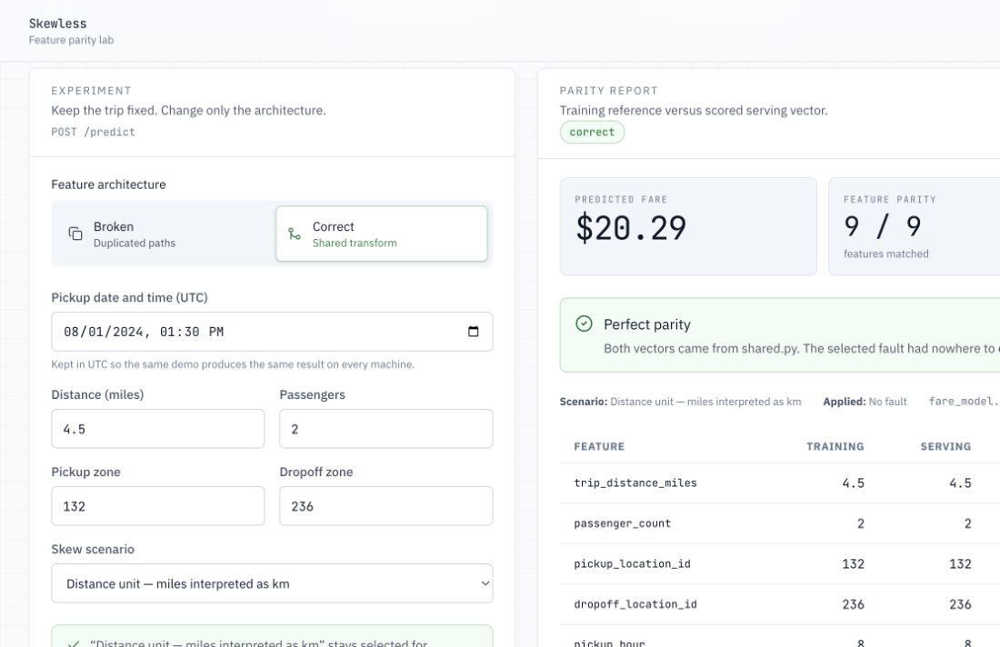

# Skewless — Training-Serving Feature Parity

> A production-shaped ML system built around one concrete, demonstrable failure mode:
> **training-serving feature skew**. Duplicated feature-engineering code can silently diverge
> between training and serving — same feature name, different value, no crash, no error, just
> a wrong prediction. Skewless makes that failure visible, then builds the rest of a real
> MLOps stack around it: model comparison, MLflow tracking, Pandera validation, SHAP
> explainability, lightweight drift monitoring, Docker, and a live deployment.

## Live demo

- **Frontend:** https://skewless.vercel.app
- **API:** https://skewless-api.onrender.com ([interactive Swagger docs](https://skewless-api.onrender.com/docs))

The backend runs on Render's free tier and spins down after 15 minutes idle — the first
request after a quiet period can take up to a minute to wake it back up.

## What it demonstrates

A distance trained in miles but served in kilometres is still a valid number. The API
doesn't crash and the model still responds — it just scores the wrong feature vector. Skewless
builds a training reference vector and a serving vector for the same raw NYC taxi trip,
compares all nine features, and scores the serving vector, so this normally-silent failure
becomes a visible `8 / 9 matched` in the response.

## Key features

- **Skew detection** — toggle between a *broken* (duplicated) and *correct* (shared) feature
  pipeline; compare all 9 features and see exactly which one silently diverged.
- **Model comparison** — Ridge, Random Forest, and LightGBM trained on the same split, scored
  on MAE/RMSE/R², lowest-RMSE candidate auto-selected.
- **MLflow tracking** — every candidate logged as its own run (params, metrics, a `selected`
  tag); only the winner's model artifact is attached.
- **Pandera validation** — a declarative schema for the raw training data, replacing
  hand-rolled row filtering.
- **SHAP explainability** — per-prediction feature contributions plus a global
  feature-importance endpoint.
- **Drift monitoring** — in-memory Population Stability Index comparison of served traffic
  against the training distribution. No database.
- **Dockerized** — backend and frontend each containerized; `docker compose up` runs the full
  stack locally.
- **Deployed** — FastAPI on Render, React on Vercel, verified live end-to-end including CORS.

## Architecture



The frontend calls the backend directly over HTTPS; the backend loads whatever the offline
training pipeline last wrote to `models/` — it never touches the training data or MLflow.
Full breakdown of every subsystem (training pipeline, Pandera schema, MLflow workflow, SHAP
internals, drift math, Docker/Render/Vercel config) is in
[`docs/ARCHITECTURE.md`](docs/ARCHITECTURE.md), including a more detailed diagram.

## Broken versus Correct

| Mode | Training features | Serving features | Result |
|---|---|---|---|
| `broken` | `canonical.py` | independent `online.py` plus an optional fault | Duplicated logic can diverge |
| `correct` | `shared.py` | the same `shared.py` | 9/9 parity by construction |

In **Broken** mode, `online.py` intentionally owns an independent implementation and never
calls `canonical.py` or `shared.py`, reproducing the maintenance risk of separate training and
production pipelines. In **Correct** mode, both paths call one transformation from
`shared.py` — fault injection has nothing separate to corrupt.



### Supported skew scenarios

| `skew_mode` | Serving behavior in Broken mode |
|---|---|
| `none` | No injected fault |
| `distance_unit` | Multiplies miles by `1.609344`, simulating kilometres in a miles feature |
| `timezone` | Derives calendar features in UTC instead of `America/New_York` |

The model schema is fixed at nine features: `trip_distance_miles`, `passenger_count`,
`pickup_location_id`, `dropoff_location_id`, `pickup_hour`, `pickup_day_of_week`,
`pickup_month`, `is_weekend`, `is_rush_hour`. The canonical and shared transformations use
identical timezone conversion, six-decimal distance rounding, missing-passenger default of
one, weekday/month extraction, weekend logic, and 07:00–10:00 / 16:00–19:00 rush-hour windows.

## Model comparison

Training compares three regressors on the same 80/20 split and selects the lowest-RMSE
candidate. Results from a full run (`--row-limit 100000`, 95,759 valid rows after Pandera
filtering):

| Model | MAE | RMSE | R² |
|---|---|---|---|
| Random Forest | 2.23 | **5.96** | 0.922 |
| LightGBM | 2.04 | 6.77 | 0.900 |
| Ridge | 2.95 | 7.06 | 0.891 |

The LightGBM row matches the currently deployed model's committed `models/metadata.json`
exactly — it was trained before this comparison step existed, with the same hyperparameters
and split. Retraining today would select Random Forest instead; the deployed model hasn't
been swapped, on purpose, so the demo's numbers stay stable while this README and
`docs/ARCHITECTURE.md` are written. Retraining regenerates `model_comparison.json` with
current numbers for whichever model wins.

## API endpoints

| Method | Path | Purpose |
|---|---|---|
| `POST` | `/predict` | Score a trip; returns the fare, both feature vectors, and the parity report |
| `POST` | `/explain` | SHAP contributions for the serving vector of the same request |
| `GET` | `/explain/global-importance` | Dataset-level mean absolute SHAP importance |
| `GET` | `/monitoring/drift` | PSI-based drift report vs. the training reference distribution |
| `GET` | `/model-info` | Model name, feature names, training metadata |
| `GET` | `/health` | Liveness check (also Render's health-check path) |

Full request/response schemas: [skewless-api.onrender.com/docs](https://skewless-api.onrender.com/docs).

## Quick start

Requirements: Python 3.11+ and Node.js 22+.

### 1. Run the API

```bash
python3 -m venv .venv
source .venv/bin/activate
python -m pip install -r requirements.txt
PYTHONPATH=src uvicorn api.main:app --reload
```

The included `models/fare_model.joblib` is ready to use. FastAPI runs at
[http://localhost:8000](http://localhost:8000); interactive docs at
[http://localhost:8000/docs](http://localhost:8000/docs).

### 2. Run the frontend

In a second terminal:

```bash
cd frontend
npm ci
npm run dev
```

Open [http://localhost:5173](http://localhost:5173). Set `VITE_API_BASE_URL` if the API is
hosted elsewhere.

### 3. Or run both with Docker

```bash
docker compose up --build
```

Starts both containers: the API at [http://localhost:8000](http://localhost:8000) and the
frontend at [http://localhost:8080](http://localhost:8080) (note: 8080, not the `npm run dev`
port 5173). The frontend's API URL is baked in at image build time via the
`VITE_API_BASE_URL` build arg; `docker-compose.yml` sets the backend's `CORS_ALLOWED_ORIGINS`
to match. Stop with `docker compose down`.

## Demo walkthrough

The UI opens with a deterministic UTC trip and `distance_unit` selected.

1. Leave the architecture on **Broken** and click **Run parity check**. Observe `8 / 9`
   matched features — `trip_distance_miles` changes from `4.5` to `7.242048`, and the serving
   vector produces a different fare (**$29.19** with the bundled model).
2. Switch only the architecture to **Correct** and run again. Both paths use `shared.py`, the
   fault is not applied, and the report shows `9 / 9` matched (**$20.29**).

```bash
curl -X POST https://skewless-api.onrender.com/predict \
  -H 'Content-Type: application/json' \
  -d '{
    "pickup_datetime": "2024-01-08T13:30:00Z",
    "pickup_location_id": 132,
    "dropoff_location_id": 236,
    "passenger_count": 2,
    "trip_distance_miles": 4.5,
    "feature_mode": "broken",
    "skew_mode": "distance_unit"
  }'
```

## Screenshots

Both captures use the same default trip and `distance_unit` scenario. Only the feature
architecture changes.

### Broken — duplicated paths



### Correct — shared transformation



Capture details: [`docs/screenshots/README.md`](docs/screenshots/README.md).

## Train the model

The trained model is committed so the demo works immediately. To reproduce it, download the
January 2024 NYC Yellow Taxi Trip Records parquet file to
`data/raw/yellow_tripdata_2024-01.parquet` (intentionally gitignored), then:

```bash
PYTHONPATH=src python -m model.train --row-limit 100000
```

This validates raw rows against a Pandera schema, drops any that fail, builds features
through `shared.py`, trains and compares the three candidates ([Model comparison](#model-comparison)
above), logs every run to MLflow, and writes:

```text
models/fare_model.joblib        # the selected model
models/metadata.json            # selected model's metadata and metrics
models/model_comparison.json    # MAE/RMSE/R² for all three candidates
models/reference_stats.json     # per-feature training distribution, for drift monitoring
```

## Tech stack

- **Model:** LightGBM, Random Forest, Ridge (scikit-learn), pandas, NumPy
- **Experiment tracking:** MLflow
- **Data validation:** Pandera
- **Explainability:** SHAP
- **Drift monitoring:** in-memory PSI (`model/drift.py`)
- **API:** FastAPI, Pydantic, Uvicorn
- **Frontend:** React, TypeScript, Tailwind CSS, Vite
- **Infra:** Docker, Render (backend), Vercel (frontend)
- **Quality:** pytest, Ruff, mypy, oxlint, GitHub Actions

## Project structure

```text
skewless/
├── src/
│   ├── features/       # canonical.py, online.py, shared.py, faults.py, parity.py
│   ├── model/          # train.py, schema.py, predictor.py, explain.py, drift.py
│   └── api/            # main.py — all six endpoints
├── frontend/
├── docs/
│   ├── ARCHITECTURE.md # full system design + diagram
│   └── screenshots/
├── models/              # committed model + JSON artifacts
├── tests/
├── Dockerfile            # backend image
├── docker-compose.yml
├── render.yaml           # Render Blueprint (backend deploy)
├── requirements.txt
└── README.md
```

## Verification

```bash
python -m pip install -e ".[dev]"

python -m pytest
python -m ruff format --check src tests
python -m ruff check src tests
python -m mypy src

cd frontend
npm run build
npm run lint
```

GitHub Actions runs the same backend and frontend checks on pushes and pull requests.

## Deploy your own copy

The backend deploys as-is from the root `Dockerfile`; the frontend deploys as a static Vite
build (no Docker involved in the actual Vercel deployment). Deploy the backend first — the
frontend build needs its URL.

**1. Backend → Render.** `render.yaml` is a Render Blueprint that builds `Dockerfile`
unchanged: dashboard → New → Blueprint → point at this repo → Free plan. Leave
`CORS_ALLOWED_ORIGINS` unset for now (the blueprint marks it manual-entry); note the
service's `.onrender.com` URL once it's live.

**2. Frontend → Vercel.** Import the repo, then set **Root Directory** to `frontend` and add
environment variable `VITE_API_BASE_URL` = the Render URL from step 1. Vercel auto-detects
Vite; `VITE_API_BASE_URL` is inlined at build time, so redeploy after changing it.

**3. Close the loop.** Once Vercel gives you a URL, set
`CORS_ALLOWED_ORIGINS=https://<your-app>.vercel.app` on the Render service (Environment tab).
Render restarts automatically. Comma-separate multiple origins if needed.
