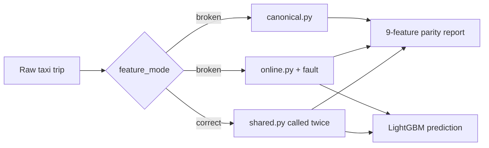

# Skewless — Training-Serving Feature Parity

> An interactive FastAPI and React demo showing how duplicated feature engineering creates training-serving skew—and how one shared transformation eliminates it.

## Why this project exists

A model can perform well during training and still return wrong production predictions without its weights changing. The failure can happen earlier in the pipeline: training and serving may calculate the same named feature differently.

A distance trained in miles but served in kilometres is still a valid number. The API does not crash and the model still responds, but it scores the wrong feature vector. This is **training-serving feature skew**.

Skewless makes that normally silent failure visible by building a training reference vector and a serving vector for the same raw NYC taxi trip, comparing all nine features, and scoring the serving vector.

## Broken versus Correct

| Mode | Training features | Serving features | Result |
|---|---|---|---|
| `broken` | `canonical.py` | independent `online.py` plus an optional fault | Duplicated logic can diverge |
| `correct` | `shared.py` | the same `shared.py` | 9/9 parity by construction |

In **Broken** mode, `online.py` intentionally owns an independent implementation and never calls `canonical.py` or `shared.py`. This reproduces the maintenance risk found in separate training and production pipelines.

In **Correct** mode, both paths call one transformation from `shared.py`. Fault injection is not applied because there is no separate serving transformation to corrupt.



## Supported skew scenarios

Only three modes exist:

| `skew_mode` | Serving behavior in Broken mode |
|---|---|
| `none` | No injected fault |
| `distance_unit` | Multiplies miles by `1.609344`, simulating kilometres in a miles feature |
| `timezone` | Derives calendar features in UTC instead of `America/New_York` |

The model schema remains fixed at nine features:

```text
trip_distance_miles   passenger_count       pickup_location_id
dropoff_location_id  pickup_hour           pickup_day_of_week
pickup_month         is_weekend            is_rush_hour
```

The canonical and shared transformations use identical timezone conversion, six-decimal distance rounding, missing-passenger default of one, weekday/month extraction, weekend logic, and 07:00–10:00 / 16:00–19:00 rush-hour windows.

## Quick start

Requirements: Python 3.11+ and Node.js 22+.

### 1. Run the API

From the repository root:

```bash
python3 -m venv .venv
source .venv/bin/activate
python -m pip install -r requirements.txt
PYTHONPATH=src uvicorn api.main:app --reload
```

The included `models/fare_model.joblib` is ready to use. FastAPI runs at [http://localhost:8000](http://localhost:8000), and its interactive OpenAPI documentation is at [http://localhost:8000/docs](http://localhost:8000/docs).

### 2. Run the frontend

In a second terminal:

```bash
cd frontend
npm ci
npm run dev
```

Open [http://localhost:5173](http://localhost:5173). The Vite development server talks to the API on port `8000`; set `VITE_API_BASE_URL` if the API is hosted elsewhere.

### 3. Or run both with Docker

```bash
docker compose up --build
```

This builds and starts both containers: the API at [http://localhost:8000](http://localhost:8000) (unchanged) and the frontend at [http://localhost:8080](http://localhost:8080) (note: 8080, not the `npm run dev` port 5173). The frontend's API URL is baked in at image build time via the `VITE_API_BASE_URL` build arg (see `frontend/Dockerfile`); the backend's `CORS_ALLOWED_ORIGINS` is set in `docker-compose.yml` to allow the containerized frontend's origin. Stop with `docker compose down`.

## Demo walkthrough

The UI opens with a deterministic UTC trip and `distance_unit` selected.

1. Leave the architecture on **Broken** and click **Run parity check**.
2. Observe `8 / 9` matched features. `trip_distance_miles` changes from `4.5` to `7.242048`, and the serving vector produces a different fare.
3. Keep the same trip and skew scenario, then switch only the architecture to **Correct**.
4. Run the check again. Both paths use `shared.py`, the fault is not applied, and the report shows `9 / 9` matched features.

With the bundled model, the current default demo produces approximately `$29.19` in Broken mode and `$20.29` in Correct mode. Small changes are expected if the model is retrained.

Direct API example:

```bash
curl -X POST http://localhost:8000/predict \
  -H 'Content-Type: application/json' \
  -d '{
    "pickup_datetime": "2024-01-08T13:30:00Z",
    "pickup_location_id": 132,
    "dropoff_location_id": 236,
    "passenger_count": 2,
    "trip_distance_miles": 4.5,
    "feature_mode": "broken",
    "skew_mode": "distance_unit"
  }'
```

The response includes the scored fare, full training and serving vectors, all nine comparisons, requested versus applied skew mode, and a concise mismatch list.

`POST /explain` accepts the same request body and returns a SHAP explanation of the *serving* prediction: a base value plus a per-feature contribution for all nine features, so you can see exactly which feature (and how much of its skew) moved the fare. `GET /explain/global-importance` returns one dataset-level feature-importance summary (mean absolute SHAP value per feature) computed from a small built-in reference sample.

## Tech stack

- **Model:** LightGBM, scikit-learn, pandas, NumPy
- **Explainability:** SHAP (`model/explain.py`)
- **Artifacts:** joblib and JSON metadata
- **API:** FastAPI, Pydantic, Uvicorn
- **Frontend:** React, TypeScript, Tailwind CSS, Vite
- **Quality:** pytest, Ruff, mypy, oxlint, GitHub Actions

## Train the model

The trained model is committed so the demo works immediately. To reproduce it, download the January 2024 NYC Yellow Taxi Trip Records Parquet file and place it at:

```text
data/raw/yellow_tripdata_2024-01.parquet
```

The raw dataset is intentionally ignored by Git. Then run:

```bash
PYTHONPATH=src python -m model.train --row-limit 100000
```

Training validates the raw rows against a Pandera schema (`model/schema.py`), dropping any row that fails a check, builds features through `shared.py`, trains three candidate regressors (Ridge, Random Forest, LightGBM) on the same split, scores each on MAE/RMSE/R², and selects the lowest-RMSE candidate. It writes:

```text
models/fare_model.joblib        # the selected model
models/metadata.json            # selected model's metadata and metrics
models/model_comparison.json    # MAE/RMSE/R² for all three candidates
```

## Project structure

```text
skewless/
├── src/
│   ├── features/
│   │   ├── canonical.py
│   │   ├── online.py
│   │   ├── shared.py
│   │   ├── parity.py
│   │   └── faults.py
│   ├── model/
│   │   ├── train.py
│   │   ├── schema.py
│   │   ├── predictor.py
│   │   └── explain.py
│   └── api/
│       └── main.py
├── frontend/
├── data/
├── docs/
│   └── screenshots/
├── models/
├── tests/
├── Dockerfile              # backend image
├── docker-compose.yml
├── render.yaml             # Render Blueprint (backend deploy)
├── requirements.txt
└── README.md
```

`frontend/Dockerfile` and `frontend/nginx.conf` build and serve the frontend image.

## Screenshots

Both captures use the same default trip and `distance_unit` scenario. Only the feature architecture changes.

### Broken — duplicated paths

The independent serving path applies the distance-unit fault. The model scores the changed serving vector, producing a `$29.19` fare with `8 / 9` features matched.


### Correct — shared transformation

The same trip runs through `shared.py` for both paths. No fault is applied, producing a `$20.29` fare with perfect `9 / 9` parity.


Capture details and naming guidance are documented in [`docs/screenshots/README.md`](docs/screenshots/README.md).

## Verification

Install the backend development dependencies before running the quality checks:

```bash
python -m pip install -e ".[dev]"
```

```bash
python -m pytest
python -m ruff format --check src tests
python -m ruff check src tests
python -m mypy src

cd frontend
npm run build
npm run lint
```

GitHub Actions runs the same backend and frontend checks on pushes and pull requests.

## Deploy

The backend deploys as-is from the existing root `Dockerfile`; the frontend deploys as a static Vite build, no Docker involved. Deploy the backend first — the frontend build needs its URL.

### 1. Backend → Render

`render.yaml` is a Render Blueprint that builds the existing `Dockerfile` unchanged:

- **Blueprint:** Render dashboard → New → Blueprint → point at this repo. It creates a Free web service from `render.yaml`.
- **Manual equivalent:** New → Web Service → this repo → Runtime: Docker → leave the Dockerfile path as `./Dockerfile`.

Leave `CORS_ALLOWED_ORIGINS` unset for now — the blueprint marks it for manual entry because it must point at the frontend's URL, which doesn't exist until step 2. After the first deploy, note the backend's URL (`https://<your-service>.onrender.com`).

Render's free web services spin down after 15 minutes idle (~1 minute cold start on the next request) — fine for a demo; upgrade the plan for always-on.

### 2. Frontend → Vercel

Import this repo in Vercel, then set two project settings (dashboard → Settings):

- **Root Directory:** `frontend`
- **Environment Variable:** `VITE_API_BASE_URL` = the Render URL from step 1

Vercel auto-detects the Vite framework and build command — no `vercel.json` needed. `VITE_API_BASE_URL` is inlined at build time (the same mechanism as the Docker frontend's build arg — see `frontend/.env.example`), so redeploy after changing it.

### 3. Close the loop: production CORS

Once Vercel gives you a URL (`https://<your-app>.vercel.app`), set it on the Render service (dashboard → Environment):

```text
CORS_ALLOWED_ORIGINS=https://<your-app>.vercel.app
```

Render restarts the service automatically when an environment variable changes. Use a comma-separated list to also allow a custom domain or additional origins.
