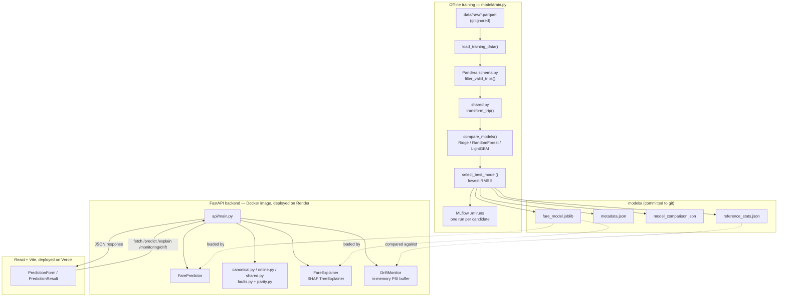

# Skewless — Architecture

This document describes the system as it is currently implemented: what runs where, how
training artifacts flow into the serving path, and how each subsystem (parity detection,
MLflow, Pandera, SHAP, drift monitoring) fits together. It reflects the actual code in
`src/`, the actual `Dockerfile`s, and the actual `render.yaml` — nothing here is aspirational.

## 1. System overview

Skewless has two independently deployable pieces and one offline pipeline that feeds them
both a shared artifact directory:

- **Offline training pipeline** (`src/model/train.py`) — run manually, not part of any live
  request path. Reads raw taxi trip data, validates it, engineers features, trains and
  compares three candidate regressors, and writes everything (model + JSON artifacts) to
  `models/`, plus one MLflow run per candidate to `./mlruns`.
- **FastAPI backend** (`src/api/`) — a Docker container that loads the committed model from
  `models/` and serves predictions, SHAP explanations, and drift reports. Deployed on Render.
- **React + Vite frontend** (`frontend/`) — a static single-page app that calls the backend
  directly from the browser. Deployed on Vercel; the Docker/nginx build of it exists only for
  local `docker compose` parity, not for the actual Vercel deployment.



**Important accuracy note:** the diagram shows all four `models/` artifacts because that's
what `model/train.py` produces on every run. The *currently committed* `models/` directory
only has `fare_model.joblib` and `metadata.json` — it predates the model-comparison and
drift-monitoring work, and it has intentionally not been retrained during this project's
build-out (each phase explicitly preserved the existing production model). `model_comparison.json`
and `reference_stats.json` will appear the next time someone runs `python -m model.train`.
Until then, `GET /monitoring/drift` correctly reports `reference_available: false`.

## 2. Data / model artifact flow

1. Raw NYC Yellow Taxi parquet (`data/raw/yellow_tripdata_2024-01.parquet`, gitignored, not
   committed) is the only external input.
2. `load_training_data()` reads it, coerces dtypes, fills missing `passenger_count` with 1,
   and validates rows through the Pandera schema (§6) — invalid rows are dropped, not raised.
3. Each remaining raw row is converted to a `TaxiTrip` (Pydantic) and run through
   `features/shared.py`'s `transform_trip()` to produce the 9-column feature `DataFrame` plus
   the `fare_amount` target `Series`.
4. That feature `DataFrame` is: (a) split train/validation and fed to `compare_models()` (§4),
   and (b) summarized into per-feature reference statistics for drift monitoring (§12).
5. `model/train.py`'s `main()` writes four files next to each other under `models/`:
   `fare_model.joblib`, `metadata.json`, `model_comparison.json`, `reference_stats.json`.
6. The FastAPI backend (`FarePredictor`, `FareExplainer`, drift's `load_reference_stats()`)
   reads these files at process startup / first request — never the raw parquet, never MLflow.
   The serving path has zero dependency on the training data file being present.

## 3. Training pipeline (`model/train.py`)

`python -m model.train --row-limit 100000 [--dataset PATH] [--model-path PATH] [--mlflow-tracking-uri URI]`

- `load_training_data(path, row_limit)` — reads the parquet (`columns=RAW_COLUMNS`), coerces
  `tpep_pickup_datetime` via `pd.to_datetime` and the numeric columns via `pd.to_numeric`
  (both `errors="coerce"`), fills `passenger_count` NaNs with 1, then calls
  `filter_valid_trips()` (Pandera). Raises `ValueError` if zero rows survive.
- `compare_models(features, target, config)` — one `train_test_split` (80/20,
  `random_state=42`, shared across all three candidates for a fair comparison), then trains
  each candidate and scores MAE / RMSE / R² on the held-out split.
- `select_best_model(results)` — `min()` by `root_mean_squared_error`.
- `log_comparison_to_mlflow(...)` — one MLflow run per candidate (§5).
- `save_model()`, `save_comparison()`, `save_reference_stats()` — write the four artifacts
  described in §2.

`MINIMUM_TRAINING_ROWS = 20` is the floor `compare_models()` enforces before training at all.

## 4. Model comparison

Three candidates, all trained on the identical split (`model/train.py:_build_candidates`):

| Name | Estimator | Key hyperparameters |
|---|---|---|
| `ridge` | `sklearn.linear_model.Ridge` | `random_state=42` (defaults otherwise) |
| `random_forest` | `sklearn.ensemble.RandomForestRegressor` | `n_estimators=200`, `random_state=42`, `n_jobs=-1` |
| `lightgbm` | `lightgbm.LGBMRegressor` | `objective="regression_l1"`, `n_estimators=300`, `learning_rate=0.05`, `num_leaves=31`, `min_child_samples=20` |

All three are scored with `mean_absolute_error`, `root_mean_squared_error`, and `r2_score`
from `sklearn.metrics`. The winner (lowest RMSE) is what gets saved as `fare_model.joblib`
and logged with its model artifact to MLflow; `model_comparison.json` records every
candidate's metrics, ranked, with `selected_model` naming the winner — so a full comparison
survives even though only one model ships.

## 5. MLflow workflow

- Local file-store tracking only: `mlflow.set_tracking_uri("file://<repo>/mlruns")`
  (`DEFAULT_MLFLOW_TRACKING_URI`, overridable via `--mlflow-tracking-uri`). No tracking
  server, no database backend.
- One caveat handled explicitly in code: MLflow ≥3 puts the plain filesystem store into
  "maintenance mode" and refuses it unless `MLFLOW_ALLOW_FILE_STORE=true` is set — `train.py`
  sets this env var itself (`os.environ.setdefault(...)`) rather than requiring the operator
  to know about it.
- Experiment name: `skewless-fare-model` (`MLFLOW_EXPERIMENT_NAME`).
- Per candidate, `log_comparison_to_mlflow()` opens one run (`run_name=<candidate>`) and logs:
  - params: `candidate` plus every `model.get_params()` hyperparameter, and `training_rows`
  - metrics: MAE, RMSE, R²
  - tag: `selected` (`True`/`False`)
  - model artifact (`mlflow.sklearn.log_model(..., name="model")`) — **only** on the winning
    candidate's run, via mlflow 3.x's "Logged Model" mechanism (not a plain run-artifact file).
- `.gitignore` excludes `mlruns/` and `mlartifacts/` — MLflow history is local-only, never
  committed, never shipped in the Docker image.

## 6. Pandera validation (`model/schema.py`)

`RawTaxiTripSchema` (a `pandera.pandas.DataFrameModel`) is the single declarative source of
truth for what a valid raw training row looks like, replacing what used to be a hand-rolled
boolean mask:

| Field | Constraint |
|---|---|
| `tpep_pickup_datetime` | non-null |
| `passenger_count` | 1–8 |
| `trip_distance` | 0.01–100.0 |
| `PULocationID` | ≥ 1 |
| `DOLocationID` | ≥ 1 |
| `fare_amount` | 0.01–500.0 |

`Config`: `coerce=True` (dtypes are already numeric/datetime from the upstream
`pd.to_numeric`/`pd.to_datetime` coercion, so this coercion pass is always lossless in
practice — it exists to reconcile int64-vs-float64 mismatches, not to parse strings) and
`strict=True` (no undeclared columns).

`filter_valid_trips(raw)` runs `RawTaxiTripSchema.validate(raw, lazy=True)`; on
`SchemaErrors` it collects every failing row index from `exc.failure_cases["index"]` and
drops exactly those rows — mirroring the *filter, don't crash* behavior the old mask had,
now expressed as one checkable schema instead of six inline `.between()`/`.ge()` calls. This
was verified to filter the same row count (95,759 of the first 100,000 rows) as the code it
replaced.

This is a separate validation layer from Pydantic's `TaxiTrip`/`FeatureVector` (§9), which
validates one API request at a time, not a training-time bulk `DataFrame`.

## 7. Training-serving parity / skew detection

This is the project's original core concept and the one every other phase was built around
without disturbing it.

- **`features/canonical.py`** and **`features/shared.py`** — byte-identical transform logic
  (deliberately duplicated as a *reference* implementation), each converting a `TaxiTrip`
  into the 9-feature `FeatureVector`: distance rounded to 6 decimals, timezone-aware hour via
  `America/New_York`, weekday/month, `is_weekend`, and `is_rush_hour` (07:00–10:00 or
  16:00–19:00 local).
- **`features/online.py`** — an intentionally *independent* re-implementation of the same
  transform, used only for serving in "broken" mode, with one addition: `apply_fault()` from
  **`features/faults.py`**.
- **`features/faults.py`** — `SkewMode` enum: `none` (no-op), `distance_unit` (multiplies
  distance by `1.609344`, simulating km stored in a miles field), `timezone` (recomputes the
  calendar features in UTC instead of `America/New_York`).
- **`features/parity.py`** — `compare_feature_vectors(training, serving)` does an
  `isclose`-tolerant field-by-field diff and returns a tuple of `FeatureMismatch`.

Two architectures, selected per-request via `PredictionRequest.feature_mode`:

| Mode | Training features | Serving features | Result |
|---|---|---|---|
| `broken` | `canonical_transform(trip)` | `online_transform(trip, skew_mode)` | Skew is possible; `distance_unit`/`timezone` produce real mismatches |
| `correct` | `shared_transform(trip)` | `shared_transform(trip)` (called twice) | Guaranteed 9/9 parity; fault is never applied (nothing to apply it to) |

`api/main.py`'s `_build_features()` is the single place this branch lives, shared by
`/predict` and `/explain` so both endpoints explain/score the exact same serving vector.

## 8. SHAP explainability (`model/explain.py`)

`FareExplainer` wraps `shap.TreeExplainer(model)` directly — no background dataset is
supplied, so SHAP uses tree-path-dependent feature perturbation to compute exact
contributions from the model's own tree structure. This works for the tree-ensemble
candidates (LightGBM, Random Forest); it does not support the linear `Ridge` candidate,
which is a known, accepted limitation given the currently shipped model is LightGBM.

- `explain_prediction(features)` → `PredictionExplanation(base_value, predicted_fare_amount,
  contributions)`, one `FeatureContribution(feature, value, shap_value)` per of the 9
  features. `base_value + Σ shap_value == predicted_fare_amount` by SHAP's additivity
  property (verified in tests and against the live deployment).
- `global_feature_importance(sample=REFERENCE_TRIPS)` → mean `|shap_value|` per feature,
  averaged over `REFERENCE_TRIPS`: six fixed, hand-picked representative trips baked into the
  module. This keeps global importance self-contained — it never touches the raw training
  parquet, so it works identically in Docker/Render where that file doesn't exist.

## 9. FastAPI inference layer (`api/main.py`)

| Endpoint | Method | Purpose |
|---|---|---|
| `/predict` | POST | Score a trip; returns fare, both feature vectors, and the parity report |
| `/explain` | POST | SHAP contributions for the *serving* vector of the same request |
| `/explain/global-importance` | GET | Dataset-level mean absolute SHAP importance |
| `/monitoring/drift` | GET | PSI-based drift report against training reference stats |
| `/model-info` | GET | Model name, feature names, training metadata |
| `/health` | GET | Liveness check (also Render's health-check path) |

Dependency wiring uses FastAPI's `Depends()` with `functools.lru_cache`-backed singleton
factories — `get_predictor()`, `get_explainer()`, `get_drift_monitor()` — so the model is
loaded once per process, not once per request. `FarePredictor` resolves the model path from
`SKEWLESS_MODEL_PATH` if set, else `models/fare_model.joblib` relative to the repo root
(`parents[2]` from `model/predictor.py`) — the same relative layout the Docker image
preserves (§10). CORS origins come from the `CORS_ALLOWED_ORIGINS` env var (comma-separated),
defaulting to the two Vite dev-server origins for local development.

## 10. Docker

Two independent, minimal Dockerfiles; no Kubernetes, no orchestration beyond
`docker-compose.yml` for local dev.

- **`Dockerfile`** (backend) — `python:3.13-slim` → installs `libgomp1` (LightGBM's compiled
  extension needs it at runtime on Debian) → `pip install -r requirements.txt` → `COPY src
  ./src` and `COPY models ./models`, preserving the exact relative layout `predictor.py`/
  `train.py` already assume → runs as a non-root `appuser` → `uvicorn api.main:app --host
  0.0.0.0 --port 8000`. Measured runtime footprint: ~187 MB RSS after exercising every
  endpoint including SHAP (comfortably inside Render's free-tier limits).
- **`frontend/Dockerfile`** — multi-stage: `node:22-slim` runs `npm ci && npm run build` with
  `VITE_API_BASE_URL` passed as a build `ARG` (Vite inlines `VITE_*` vars at build time, not
  runtime), then the static `dist/` output is served by `nginx:1.27-alpine` on port 80 with a
  minimal SPA-fallback `nginx.conf`.
- **`docker-compose.yml`** — `backend` (host `8000`) and `frontend` (host `8080`,
  `depends_on: backend`), with `CORS_ALLOWED_ORIGINS` set to the frontend's compose-published
  origin (`http://localhost:8080`) so the containerized frontend can actually call the
  containerized backend.
- `.dockerignore` at both the repo root and `frontend/` keep `.venv`, `node_modules`,
  `data/`, `mlruns/`, and test/doc directories out of build contexts.

## 11. Deployment: Render + Vercel

**Backend → Render**, from the unmodified root `Dockerfile` via `render.yaml` (a Render
Blueprint):

```yaml
services:
  - type: web
    name: skewless-api
    runtime: docker
    dockerfilePath: ./Dockerfile
    dockerContext: .
    plan: free
    healthCheckPath: /health
    envVars:
      - key: CORS_ALLOWED_ORIGINS
        sync: false   # set manually once the frontend URL exists
```

**Frontend → Vercel**, as a static Vite build (no Docker involved in the actual deployment —
the frontend Dockerfile exists only for local Compose parity): Root Directory set to
`frontend`, framework auto-detected as Vite, `VITE_API_BASE_URL` set as a dashboard
Environment Variable pointing at the Render URL.

**Deploy order** (a real dependency, not arbitrary): backend first (its URL doesn't depend on
anything) → frontend build needs that URL for `VITE_API_BASE_URL` → backend's
`CORS_ALLOWED_ORIGINS` needs the frontend's URL, set last, which triggers a Render restart.

Both are live and were verified end-to-end (including a real CORS preflight check with the
production `Origin` header) as of this writing:

- Backend: `https://skewless-api.onrender.com`
- Frontend: `https://skewless.vercel.app`

Render's free tier spins the service down after 15 minutes idle (~1 minute cold start on the
next request); this is accepted, not worked around, for a demo deployment.

## 12. Drift monitoring (`model/drift.py`)

Deliberately lightweight: **no database, no Kafka, no Prometheus** — just one in-memory
buffer per backend process, checked against a JSON snapshot from training time.

- **Reference statistics** — `compute_reference_stats(features)`, called once at the end of
  training, computes per-feature `mean`, `std`, `min`, `max`, plus decile bin edges
  (`np.quantile`, deduplicated, outer edges pinned to `±inf`) and each bin's proportion of
  training rows. Saved to `models/reference_stats.json` (§2).
- **Serving-side buffer** — `DriftMonitor` holds a `collections.deque(maxlen=500)` of
  recently served `FeatureVector`s. `api/main.py`'s `/predict` handler calls
  `drift_monitor.record(serving_features)` on every request — the same vector that was
  actually scored, for both `broken` and `correct` architectures. The buffer is process-local
  and resets on restart/redeploy; this is accepted, not a defect, for a single-worker demo
  (Render's default `WEB_CONCURRENCY=1` matches this assumption).
- **Drift calculation** — `compute_feature_psi()` buckets the buffer's current values into
  the *reference's own* bin edges and computes the Population Stability Index against the
  reference proportions: `Σ (cur% − ref%) · ln(cur% / ref%)`, per feature.
- **Thresholds**: PSI `< 0.1` → `stable`; `0.1–0.25` → `moderate`; `≥ 0.25` → `significant`.
  Overall status is the worst of any single feature's status.
- **`GET /monitoring/drift`** returns `{status, sample_count, reference_available, features[]}`
  and degrades gracefully in both directions that matter in practice: `reference_available:
  false` if `reference_stats.json` doesn't exist yet (true today for the committed model —
  see §1's accuracy note), and `status: "insufficient_data"` until at least 30 samples have
  been recorded (`MINIMUM_SAMPLES_FOR_DRIFT`), since PSI on a handful of points is noise, not
  signal.

## Source map

```text
src/
├── features/
│   ├── canonical.py   # reference training-side transform (§7)
│   ├── online.py      # independent serving-side transform + fault injection (§7)
│   ├── shared.py       # single transform used by both sides in "correct" mode (§7)
│   ├── faults.py        # SkewMode enum + apply_fault() (§7)
│   └── parity.py         # compare_feature_vectors() (§7)
├── model/
│   ├── train.py         # training pipeline entry point (§3, §4, §5)
│   ├── schema.py         # Pandera RawTaxiTripSchema (§6)
│   ├── predictor.py       # FarePredictor: loads models/fare_model.joblib (§9)
│   ├── explain.py          # FareExplainer: SHAP (§8)
│   └── drift.py             # ReferenceStats + DriftMonitor + PSI (§12)
└── api/
    └── main.py               # FastAPI app, all six endpoints (§9)
```
